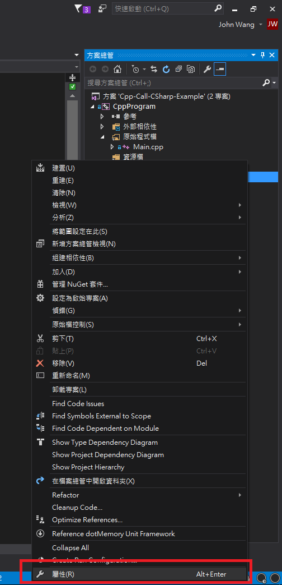
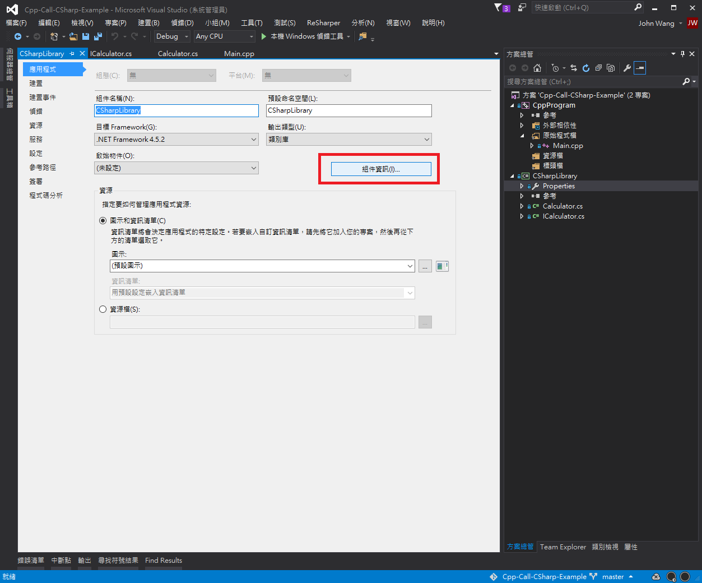
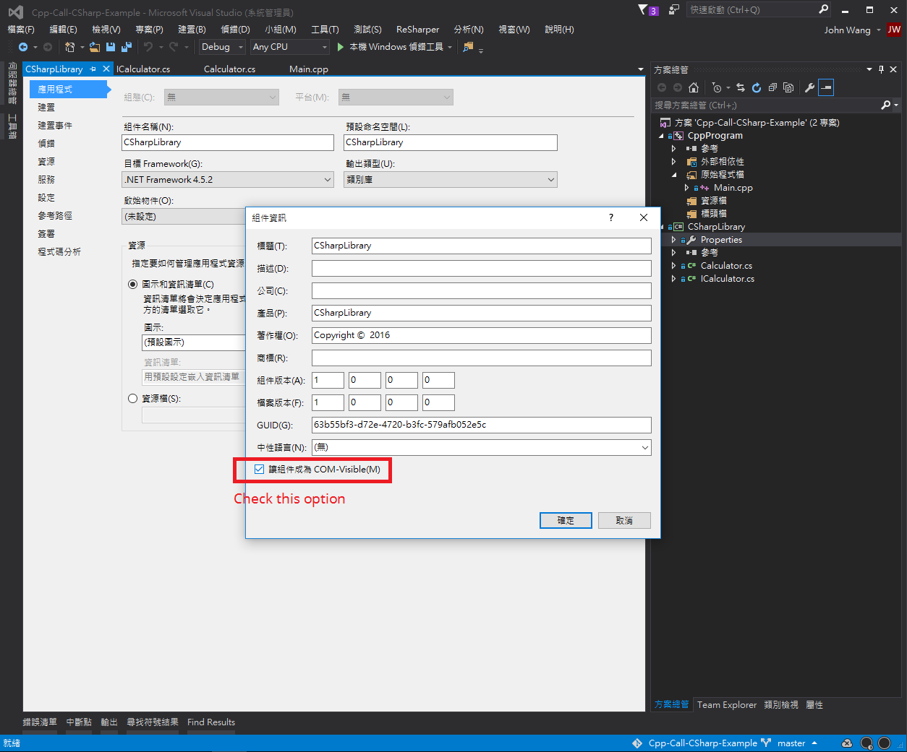
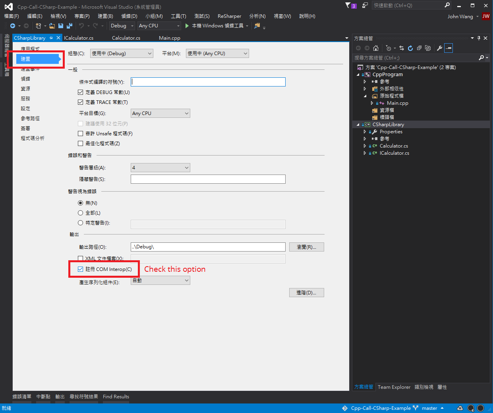
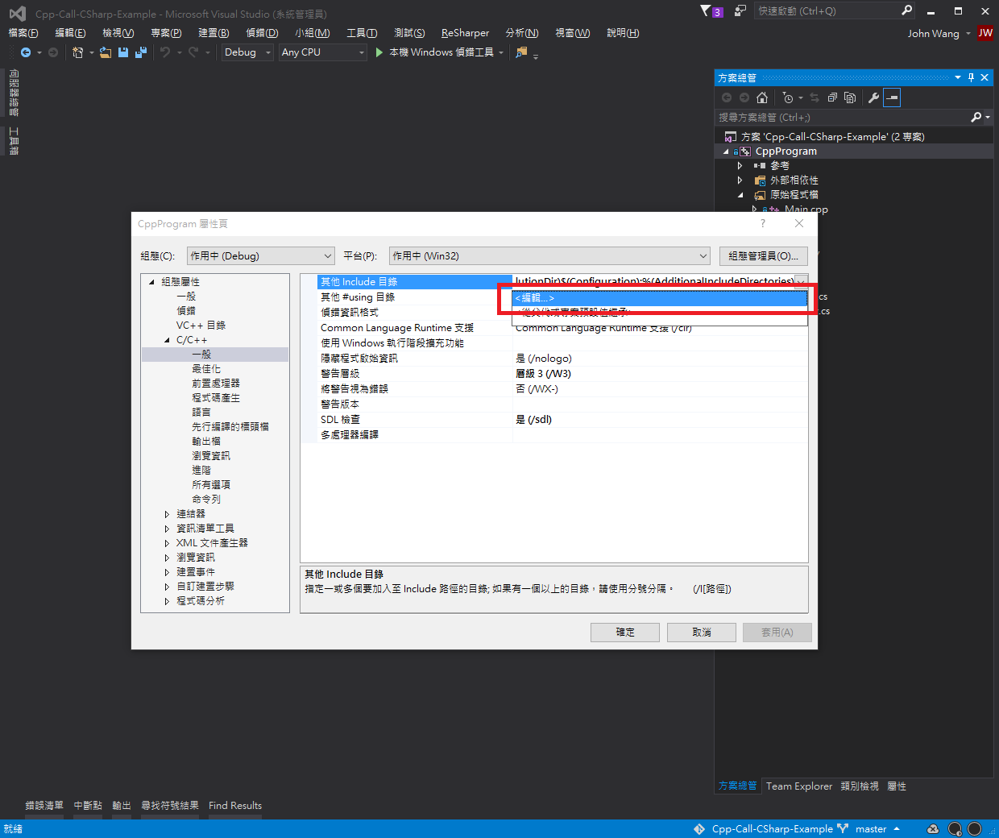
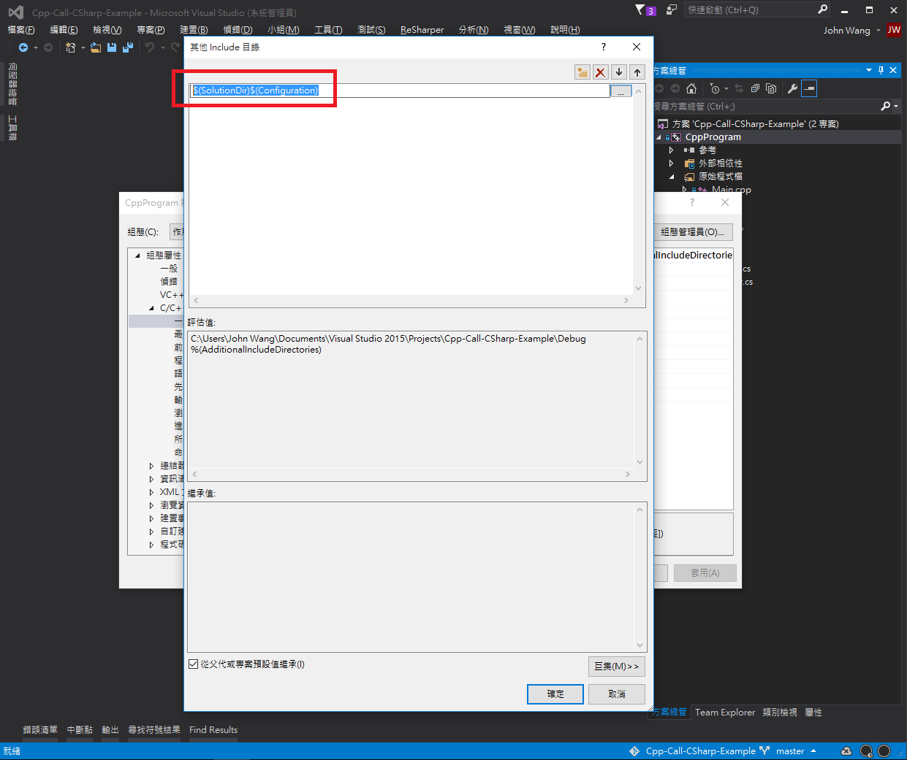

# Cpp-Call-CSharp-Example
A Visual Studio 2015 example of calling C# COM library from C++ code.

## Key Project Settings
### C# Library Project
1. Open "Properties" page of your C# library project

     
2. Click the "Assembly Information" button

     
3. Check the "COM-Visible" option

     
4. Navigate the the "Build" tab
5. Check the "Register for COM interop" option

     
6. Set the "output path" to the location you want
7. Save all changes

### C++ Project Settings (optional)
1. Open "Properties" dialog of your C++ project
2. At the property dialog, locate C/C++ -> General and open the "Additional Include Directories" setting dialog

    
4. Add the output path of your C# library project into the additional include directories of your C++ project

     
5. Save all changes
